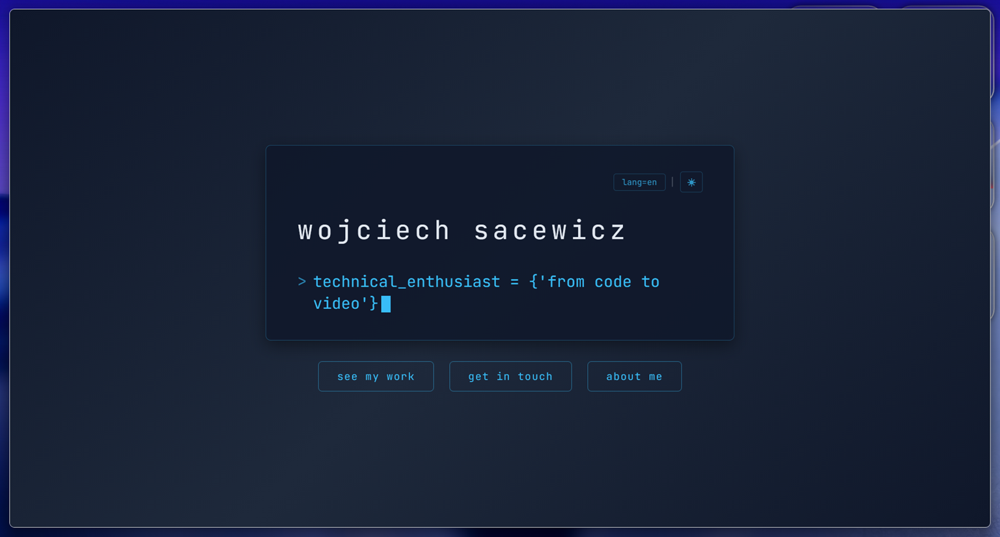

# my portfolio

> a terminal-themed portfolio website built with html, css, and javascript.

## overview

this project is a personal portfolio website designed to look and feel like a modern terminal interface. it features a clean, dark aesthetic with neon accents, typing effects, and a unique "matrix" explosion animation. the goal was to create an interactive and visually engaging experience without relying on frameworks.

this is basically my business card.

## tech stack
-   **html5**: semantic structure.
-   **css3**: custom properties (variables), flexbox, grid, and animations.
-   **javascript (es6+)**: dom manipulation, local storage for preferences, and interactive logic.

## credits

-   **fonts**: [jetbrains mono](https://fonts.google.com/specimen/JetBrains+Mono)